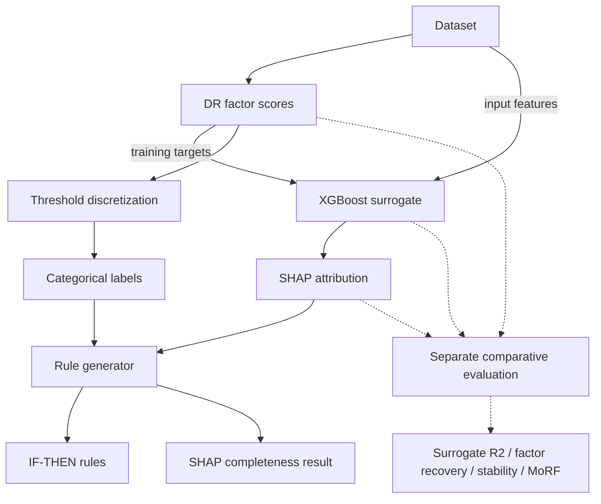
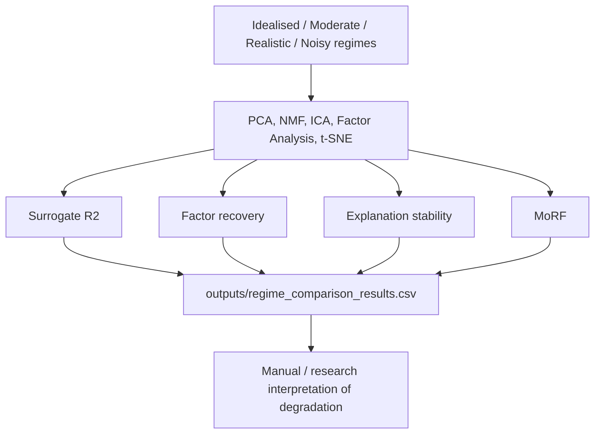

# Explainable AI for Dimensionality Reduction in Finance

**BSc Individual Project, King's College London**
**Author:** Bernardo Guterres
**Supervisor:** Dr. David Watson
**Date:** April 2026

[](https://www.python.org/downloads/)

This repository is the implementation accompanying a BSc thesis on converting continuous
dimensionality-reduction (DR) outputs into auditable, categorical IF-THEN rules for financial
applications.

## Research problem

Continuous XAI outputs, such as SHAP values and factor loadings, cannot be directly consumed as
discrete business rules, so this project builds and evaluates a pipeline that discretizes them
into thresholded, human-readable statements while measuring where that translation holds up.

## Core contribution

A threshold discretization framework (`threshold_discretizer.py` and `rule_generator.py`) that
turns per-factor DR scores into LOW/MEDIUM/HIGH categories, attributes each category to its
driving features via SHAP, and emits IF-THEN rules with explicit thresholds and sample counts.
The more central contribution is not the rule format itself but the accompanying diagnostic
layer: checks and separate comparative experiments (surrogate fidelity, SHAP completeness,
cross-seed stability, factor recovery, and noise-regime behaviour) that surface limitations to
consider before relying on the generated rules, rather than an automated trust classifier.

## Framework architecture

The unified `DRExplainer` class (`code/xai_dr_comparison.py`) wraps six DR methods behind one
interface: PCA, NMF, ICA, Factor Analysis, t-SNE, and UMAP. Only one path produces the audited
IF-THEN rules; the supplementary modules in the [Implementation map](#implementation-map) are
separate experiments and do not feed the same rule generator. `RuleGenerator.generate_rules()`
returns the emitted rules plus a SHAP-completeness result; surrogate R², factor recovery,
stability, and MoRF are computed separately, mainly in `xai_dr_comparison.py` and the regime
comparison script.



## Reported results and validity boundaries

The following figures are reported in the submitted thesis. Their original CSV, JSON and PNG
evidence files are not committed. The current entry points (see [Reproduction](#reproduction))
regenerate portions of the experimental output, but not every thesis artefact or the complete
reported 36-rule set.

- 36 IF-THEN rules generated across 4 PCA factors and 3 discretization strategies.
- Held-out surrogate R² scores reported for the synthetic credit-risk case study (thesis Table
  5.6), against a 0.85 validation threshold:

  | Factor | Surrogate R² | Passes 0.85? |
  |---|---|---|
  | PC1 | 0.981 | Yes |
  | PC2 | 0.904 | Yes |
  | PC3 | 0.737 | No |
  | PC4 | 0.777 | No |

  Two of the four factors passed the stated threshold.
- A maximum SHAP completeness error of 0.821, with a 76.2% pass rate across approximately 2,000
  sample-factor comparisons. `epsilon = 0.01` is multiplied by the global range across the
  supplied factor-score array to produce the check's absolute threshold, not used directly as a
  fixed bound. The check compares summed SHAP values against `factor_score - mean_factor_score`,
  not the surrogate prediction and TreeSHAP expected value, so it reads as a pipeline diagnostic
  rather than a pure TreeSHAP-completeness test; the error can include both surrogate residual
  error and baseline mismatch.
- Quantile discretization producing roughly 40x smaller threshold shift than
  standard-deviation discretization under a 5% synthetic outlier-contamination test (mean shift
  0.03 vs. 1.20). This is a specific, narrow robustness test, not a general stability guarantee.

The thesis is explicit that several of these metrics are partially self-referential. A high
surrogate R² in the linear-method experiments (PCA, NMF, ICA, Factor Analysis) primarily shows
that XGBoost approximated the generated embedding closely, not that SHAP faithfully explains the
original DR process. Factor recovery on synthetic data with constructed latent factors is
similarly self-referential, since the ground-truth factors were built into the generator.
Non-linear methods (t-SNE, UMAP) must be read separately, since they have no native loadings and
rely entirely on surrogate-based explanations. These metrics are necessary diagnostic
constraints, not sufficient evidence of real-world interpretability, and the thesis calls for
external validation on real financial data.

## Noise-regime reliability evaluation

`run_regime_comparison.py` runs the pipeline across four calibrated noise regimes (idealised,
moderate, realistic, noisy) using five of the six DR methods supported by `DRExplainer`: PCA,
NMF, ICA, Factor Analysis, and t-SNE. UMAP is not included in this default run.



Per the thesis, results degrade unevenly across methods as noise increases; PCA surrogate R²
turns negative in the noisy regime while NMF stays comparatively stable. The script does not
classify results as reliable or unreliable; it writes the metrics, and interpreting the
degradation pattern is left to the reader.

## Example rule format

The rule generator produces one rule per factor/category combination, for example:

```
IF PC1 is LOW (-6.36 <= score < -0.41, n=167)
THEN primary drivers are:
  - Earnings_Growth (SHAP: -0.177)
  - Debt_to_Equity (SHAP: -0.159)
  - Volatility_1Y (SHAP: -0.145)
```

Locally generated outputs span CSV, JSON, plain-text, PNG, and PyTorch `.pt` files
(sparse-autoencoder weights). None are currently committed; only documentation lives under
`outputs/`.

## Implementation map

`code/` contains 13 Python modules (~7,600 lines):

| Module | Role |
|---|---|
| `xai_dr_comparison.py` | Unified `DRExplainer` (PCA, NMF, ICA, FA, t-SNE, UMAP), surrogate training, evaluation metrics |
| `threshold_discretizer.py` | Four discretization strategies (quantile, std, domain, hybrid) |
| `rule_generator.py` | Core rule synthesis from factor scores + SHAP values |
| `run_all_experiments.py` | Orchestrates the DR comparison experiment |
| `run_regime_comparison.py` | Runs the five-method, four-regime noise evaluation |
| `case_study_credit_risk.py` | Regulatory-oriented case study on synthetic credit data |
| `semi_synthetic_generator.py` | Calibrated noise-regime data generator |
| `data_loaders.py` | Dataset loaders (Fama-French, Yahoo, Lending Club) and synthetic credit-data generation |
| `cluster_shapley.py` | Supplementary: ClusterShapley attribution for t-SNE/UMAP clusters |
| `sparse_autoencoder.py` | Supplementary: TopK/L1/Gated sparse autoencoders |
| `beta_tcvae.py` | Supplementary: β-TCVAE with disentanglement metrics |
| `probing_classifiers.py` | Supplementary: probing classifier framework |
| `integrated_gradients.py` | Supplementary: integrated-gradients attribution for autoencoders |

## Reproduction

All commands below assume the working directory is the repository root.

```bash
git clone https://github.com/bernardoguterres/xai-dr-finance.git
cd xai-dr-finance

python3 -m venv venv
source venv/bin/activate  # Windows: venv\Scripts\activate
pip install -r requirements.txt

# Run experiments (writes into outputs/, created if absent)
python code/run_all_experiments.py --method all
python code/run_regime_comparison.py
python code/case_study_credit_risk.py
```

These three commands cover only part of the pipeline. `run_all_experiments.py --method all`
orchestrates the DR comparison, ClusterShapley, sparse-autoencoder, β-TCVAE, and probing
experiments; despite its name, it does not run `rule_generator.py` or `integrated_gradients.py`,
so it does not regenerate every thesis artefact or the reported 36-rule set. `rule_generator.py`
is not a standalone reproduction command: its `__main__` block runs against simulated factor
scores and synthetically corrected SHAP values, and its default export path is hard-coded to
`/home/claude/outputs`, not a path in this repo.

`REPRODUCTION_GUIDE.md` exists but uses working-directory and output-path instructions that do
not match the commands above, references UMAP where the current regime runner excludes it, and
claims exact deterministic reproduction; it remains documentation debt and should not currently
be treated as the canonical reproduction guide. Small numerical differences are otherwise
expected across dependency versions, hardware, and stochastic libraries (t-SNE, UMAP, PyTorch);
exact reproduction is not guaranteed even with a fixed seed.

## Testing scope

`tests/test_threshold_discretizer.py` defines 42 test functions covering the threshold
discretization module: correctness, robustness to invalid input, edge cases, and strategy
integration. Two (domain-threshold validation cases) are marked skipped, since that validation
is not implemented in the current version. Coverage is limited to this one subsystem; the DR
comparison, rule generation, case study, and supplementary modules have no automated tests.

## Limitations

- Surrogate R² and factor-recovery metrics are partially self-referential for the linear DR
  methods and on synthetic linear data; they constrain rather than prove interpretability, as
  discussed above.
- All reported results, including the credit-risk case study, are on synthetic or
  semi-synthetic data; there is no evaluation on real financial data in this repository.
- The SHAP completeness check is a pipeline diagnostic, not a pure TreeSHAP-completeness test
  (see [Reported results](#reported-results-and-validity-boundaries) above).
- Thresholds are static; there is no drift detection or recalibration mechanism.
- There is no human evaluation of whether the generated rules are actually interpretable to
  practitioners.
- Test coverage is limited to the discretization module.

## Thesis and citation

The full thesis PDF (`thesis.pdf`) is at the repository root.

```bibtex
@thesis{guterres2026xai,
  title={Explainable AI for Dimensionality Reduction in Finance:
         Bridging Continuous Outputs and Discrete Business Rules},
  author={Guterres, Bernardo},
  year={2026},
  school={King's College London},
  type={BSc Individual Project}
}
```

## License status

No `LICENSE` file is currently present in this repository. All rights are reserved by default
under copyright law until a license is added; do not assume permissive reuse.

## Contact

**Bernardo Guterres**
King's College London
Email: bernardomloguterres@gmail.com
